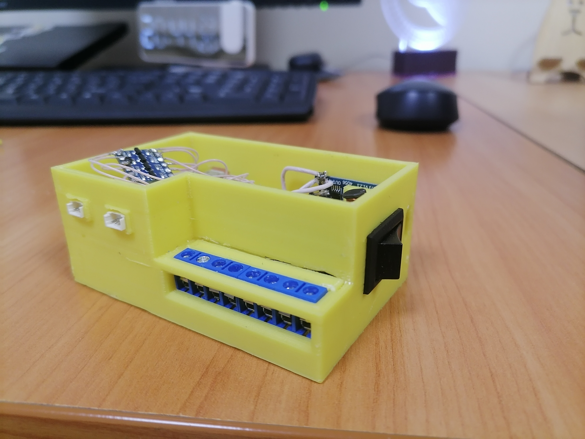
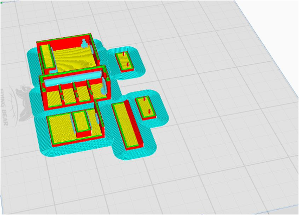
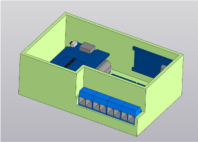
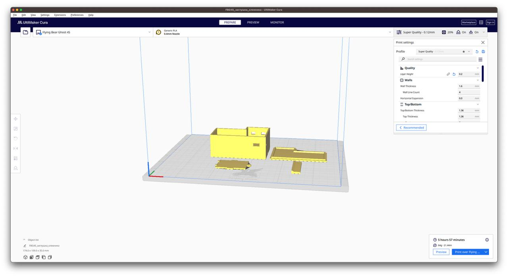
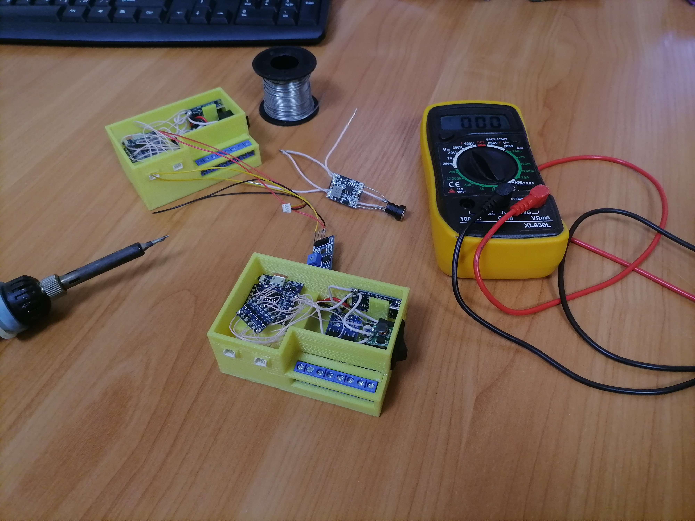
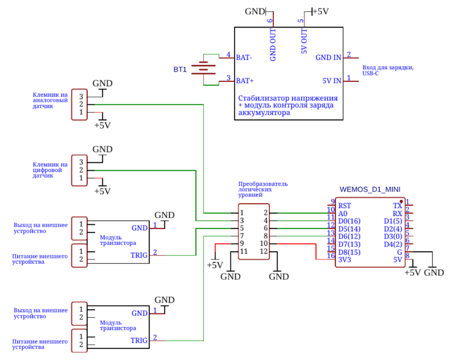
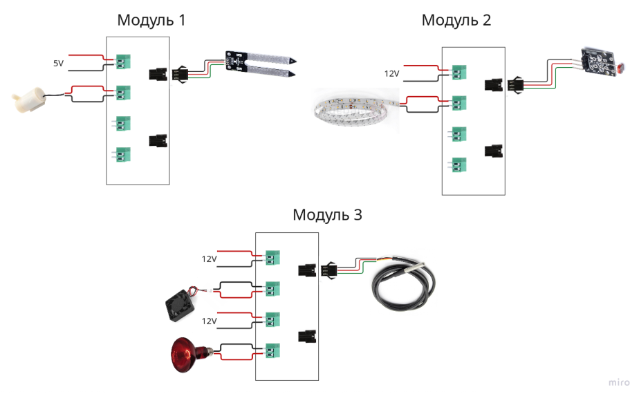

# Smart Greenhouse

<p align="center">
  <i>Автоматизированная теплица на Raspberry Pi 5 и модулях ESP8266</i>
</p>

<h4 align="center">
  <a href="https://img.shields.io/badge/license-MIT-blue.svg?style=flat-square">
    
  </a>
  <a href="https://img.shields.io/badge/backend-Spring%20Boot-6DB33F?style=flat-square&logo=springboot&logoColor=white">
    
  </a>
  <a href="https://img.shields.io/badge/hardware-Raspberry%20Pi%205-critical?style=flat-square&logo=raspberrypi&logoColor=white">
    
  </a>
  <a href="https://img.shields.io/badge/nodes-ESP8266-lightgrey?style=flat-square">
    
  </a>
</h4>

<p align="center">
  
</p>

## Введение

`Smart Greenhouse` — система, которая централизованно собирает данные с датчиков, управляет поливом, освещением и вентиляцией, а ещё позволяет переназначать роли модулей через веб-интерфейс без перепрошивки. На базе Raspberry Pi 5 (сервер) и универсальных ESP8266 (периферия) система остаётся автономной в локальной сети и готова к работе даже при потере внешнего интернета.

<details open>
<summary>
 Основные возможности
</summary> <br />

- Сбор телеметрии: температура, влажность воздуха и почвы, освещённость, уровень воды.
- Управление насосами, вентиляторами и освещением через серверные сценарии или вручную из веб-интерфейса.
- Гибкая переконфигурация ролей модулей ESP8266 без перепрошивки — всё задаётся из UI.
- Логирование событий и параметров для анализа режимов работы теплицы.
- Удалённый доступ по LAN/Internet; автономность при пропадании внешней связи.

<p align="center">
  
  &nbsp;
  
</p>

<p align="center">
  
  &nbsp;
  
</p>

</details>

## Архитектура

<p align="center">
  
</p>

<p align="center">
  
</p>

- **Центральный сервер**: Raspberry Pi 5 с backend на Spring Boot; API для фронтенда и модулей.
- **Универсальные модули ESP8266**: принимают команды сервера и отдают телеметрию по HTTP/REST.
- **Сенсоры**: BME680 (температура/давление/влажность), фоторезистор, датчик влажности почвы.
- **Исполнительные механизмы**: насос (полив), вентилятор (проветривание), LED-лента (досветка) через MOSFET.

## Быстрый старт

<details open>
<summary>Предварительные требования</summary> <br />

- Node.js LTS и npm.
- Java 17+ и Docker (для СУБД или сопутствующих сервисов).
- Git.

</details>

<details open>
<summary>Запуск backend (Spring Boot)</summary> <br />

```bash
cd backend
./gradlew bootRun
```

Сервер поднимет REST API, к которому обращаются фронтенд и ESP-модули.

</details>

<details open>
<summary>Запуск frontend (Vite + TS)</summary> <br />

```bash
cd frontend
npm install
npm run dev -- --host
```

После старта UI доступен в браузере (по умолчанию `http://localhost:5173`).

</details>

<details>
<summary>Эмуляция ESP-модулей</summary> <br />

Для локальной отладки можно поднять мок-сервер:

```bash
cd mocks/esp-mock
npm install
npm start
```

Файлы [`server.js`](./mocks/esp-mock/server.js) и [`package.json`](./mocks/esp-mock/package.json) содержат сценарий ответа, имитирующий прошивку ESP8266.

</details>

## Документация

- Архитектура проекта: [`doc/arc.md`](./doc/arc.md)
- REST-спецификация и протоколы взаимодействия модулей: [`doc/openapi.yaml`](./doc/openapi.yaml)
- Схемы подключения и изображения сборки: [`.resource/`](.resource/)
- Отчет проекта: [`doc/project-report.md`](./doc/project-report.md) [`doc/Отчет.pdf`](./doc/Отчет.pdf)

## Команда

- Васильев Никита, Брель Мария — веб-интерфейс
- Таджединов Рамиль, Шмунк Андрей — бэкэнд, железо
- Ступин Тимур — 3D, железо

<p align="center" style="margin-top: 12px;">
  <a href="https://github.com/kihort-si" title="Васильев Никита — фронтенд" style="display: inline-block; text-align: center; margin: 0 10px;">
    
    <br/><sub>@kihort-si</sub>
  </a>
  <a href="https://github.com/palloHiiri" title="Брель Мария — фронтенд" style="display: inline-block; text-align: center; margin: 0 10px;">
    
    <br/><sub>@palloHiiri</sub>
  </a>
  <a href="https://github.com/r4m63" title="Таджединов Рамиль — бэкэнд/железо" style="display: inline-block; text-align: center; margin: 0 10px;">
    
    <br/><sub>@r4m63</sub>
  </a>
  <a href="https://github.com/Gastozavr" title="Шмунк Андрей — бэкэнд/железо" style="display: inline-block; text-align: center; margin: 0 10px;">
    
    <br/><sub>@Gastozavr</sub>
  </a>
  <a href="https://github.com/timur1516" title="Ступин Тимур — 3D/железо" style="display: inline-block; text-align: center; margin: 0 10px;">
    
    <br/><sub>@timur1516</sub>
  </a>
</p>

## План испытаний

- Функциональные тесты: сбор телеметрии и управление всеми исполнительными устройствами.
- Надёжность: устойчивость при сбоях Wi-Fi и просадках питания, автономный режим в LAN.
- Эксплуатационные: работа при +5...+50 °C и влажности до 95%.

## Лицензия

Проект распространяется по лицензии MIT. Текст — в файле [`LICENSE`](./LICENSE).
